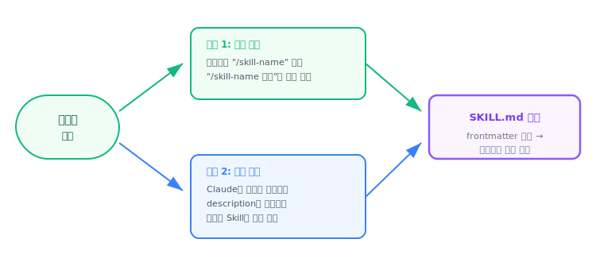
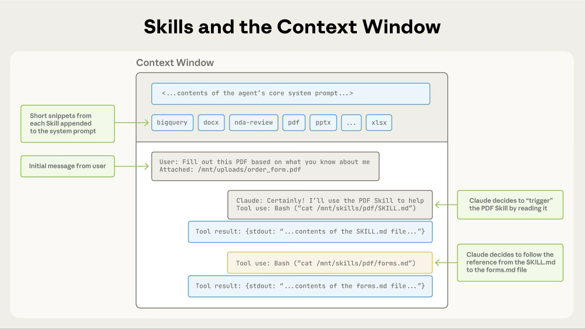

[← 이전: Skills란 무엇인가?](01-what-is-skills.md) | [목차](index.md) | [다음: 실습 1: 첫 번째 Skills 만들기 →](03-lab-first-skills.md)

---

# 2. Skills의 동작 원리

> **이 섹션에서 배울 것**: SKILLS.md 파일의 구조, 저장 위치와 우선순위, 자동 로드 vs 수동 호출의 차이

## SKILLS.md 파일 구조

모든 Skill은 `SKILLS.md` 파일 하나로 정의됩니다. 이 파일은 두 부분으로 구성됩니다:

```
---                          <-- frontmatter 시작
name: my-skills               <-- 메타데이터 (YAML 형식)
description: 이 Skill의 설명
---                          <-- frontmatter 끝

여기서부터는 마크다운 본문입니다.  <-- Skill의 실제 지침
Claude가 이 내용을 읽고 작업을 수행합니다.
```

**frontmatter**는 Skill의 메타데이터를 담고 있습니다. `---`로 감싸진 YAML 형식의 헤더이며, Skill의 이름, 설명, 동작 방식 등을 정의합니다.

**마크다운 본문**은 Claude가 실제로 따라야 할 지침입니다. 일반 마크다운 문법을 사용하여 자유롭게 작성합니다.

## Skills가 저장되는 위치와 우선순위

Skills는 네 가지 위치에 저장할 수 있으며, 적용 범위가 다릅니다:

| 위치 | 경로 | 적용 대상 |
|------|------|----------|
| Enterprise | `managed-settings.json`에서 설정하는 듯함(좀 더 알아볼 필요있음) | 조직의 모든 사용자 |
| Personal | `~/.claude/skills/<skills-name>/SKILLS.md` | 모든 프로젝트 |
| Project | `.claude/skills/<skills-name>/SKILLS.md` | 이 프로젝트만 |
| Plugin | `<plugin>/skills/<skills-name>/SKILLS.md` | 플러그인이 활성화된 위치 |

> **우선순위**: Enterprise > Personal > Project 순으로 우선합니다.

> **같은 이름의 Skills가 여러 위치에 있으면?** 
우선순위가 높은 쪽이 사용됩니다(한쪽만 load). 예를 들어 Enterprise와 Personal에 동시에 `fix-bug` Skills가 존재한다면, Enterprise의 `fix-bug`가 적용됩니다. Plugin Skills는 `plugin-name:skills-name` 네임스페이스를 사용하므로 다른 레벨과 충돌하지 않습니다(2개의 skills가 load될 수 있음).

## 자동 로드 vs 수동 호출

Skills는 두 가지 방식으로 활성화됩니다:

<p align="center"></p>

**수동 호출**: 사용자가 `/explain-code` 처럼 슬래시 명령어로 직접 호출합니다.

**자동 로드**: Claude가 사용자의 요청 내용과 Skill의 `description`을 비교하여, 적합한 Skills가 있으면 자동으로 로드합니다.
- 세션이 시작될 때, 모든 frontmatter내용이 시스템 프롬프트에 포함되어 어떤 skills를 사용할지 판단할 수 있음

> **주의**: `disable-model-invocation: true`로 설정하면 자동 로드가 비활성화되어 수동 호출로만 사용할 수 있습니다. 반대로 `user-invocable: false`로 설정하면 `/` 메뉴에서 숨겨지고 자동 로드로만 작동합니다.

## 전체 동작 흐름

1. 모든 skill의 frontmatter를 시스템 프롬프트로 agent에게 제공 - skills directory가 변경시 해당 내용도 자동으로 다시 제공
2. 사용자 요청 ex) "이 pdf에서 텍스트 추출 및 요약"
3. Claude에서 기본 지침 load - SKILL.md파일 load
4. Claude에서 추가로 load할 파일 판단 - 해당 skill directory에 있는 추가 파일들
5. 해당 지침 기반 실행 - SKILL.md 및 필요 파일을 기반으로 실행




---

[← 이전: Skills란 무엇인가?](01-what-is-skills.md) | [목차](index.md) | [다음: 실습 1: 첫 번째 Skills 만들기 →](03-lab-first-skills.md)
