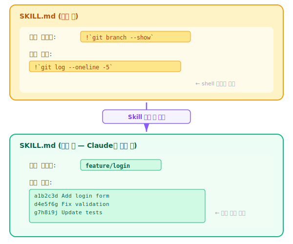

[← 이전: 실습 2: 인수를 받는 Skill](04-lab-arguments.md) | [목차](index.md) | [다음: 실습 4: Subagent 실행 →](06-lab-subagent.md)

---

# 5. 실습 3: 동적 컨텍스트 주입 Skill

> **이 섹션에서 배울 것**: `!`\``command`\`` 구문으로 shell 명령어 결과를 Skill에 동적으로 주입하는 방법

## 동적 컨텍스트 주입이란?

SKILL.md 안에 `` !`command` `` 구문을 넣으면, Skill이 로드될 때 해당 shell 명령어가 실행되고, 그 출력 결과가 SKILL.md 본문에 삽입됩니다.

<p align="center"></p>

> **핵심 포인트**: `` !`command` `` 구문을 사용하면 Skill이 호출될 때마다 최신 정보를 가져올 수 있습니다. 정적인 지침만으로는 불가능한, 현재 상태에 기반한 동적 작업이 가능해집니다.

> **주의 사항**: `` !`command` ``에는 `$ARGUMENTS`를 사용할 수 없습니다.

## 예제: pr-summary Skill

현재 브랜치의 변경 사항을 요약하여 PR 설명을 자동 생성하는 Skill입니다.


```bash
mkdir -p .claude/skills/pr-summary
```

`.claude/skills/pr-summary/SKILL.md`:

````markdown
---
name: pr-summary
description: > 
  Analyzes current branch changes and generates a PR description
  with summary, change list, and test plan.
  Use when creating a pull request or summarizing branch changes.

---

# PR 요약 생성 Skill

## 현재 Git 상태

현재 브랜치:
!`git branch --show-current`

base 브랜치와의 차이 (커밋 목록):
!`git log --oneline master..HEAD 2>/dev/null || echo "(base 브랜치와 비교할 수 없습니다)"`

변경된 파일 목록:
!`git diff --name-status master..HEAD 2>/dev/null || echo "(no changes)"`

변경 통계:
!`git diff --stat master..HEAD 2>/dev/null || echo "(no stats)"`

## 작업 지침

위의 Git 정보를 기반으로 PR 설명을 생성하세요.

### PR 설명 형식

다음 형식에서 <!-- --> 주석은 제거하고 PR 설명을 작성하세요:

```markdown
## Summary
<!-- 이 PR이 무엇을 하는지 1-3문장으로 요약 -->

## Changes
<!-- 주요 변경 사항을 불릿 포인트로 정리 -->

## Test Plan
<!-- 테스트 방법을 체크리스트로 작성 -->
```

### 규칙
- 커밋 메시지를 그대로 복사하지 말고, 변경의 목적과 영향을 설명하세요
- 기술적 세부사항보다 "왜"에 초점을 맞추세요
- 리뷰어가 변경 사항을 빠르게 파악할 수 있도록 작성하세요
````

**사용 방법**:

```
/pr-summary
```

Claude가 이 Skill을 로드하면:
1. `git branch --show-current` 실행 -> 현재 브랜치 이름 주입
2. `git log --oneline main..HEAD` 실행 -> 커밋 목록 주입
3. `git diff --name-status main..HEAD` 실행 -> 변경 파일 목록 주입
4. `git diff --stat main..HEAD` 실행 -> 변경 통계 주입

이 정보를 바탕으로 Claude가 PR 설명을 자동 생성합니다.

> **⚠ 보안 주의**: `` !`command` `` 구문은 Skill이 로드되는 순간 실제 shell 명령어를 실행합니다. 신뢰할 수 없는 출처의 SKILL.md 파일을 사용할 경우, 악의적인 명령어가 실행될 수 있습니다. Project Skills(`.claude/skills/`)를 외부에서 가져올 때는 반드시 SKILL.md 내용을 먼저 확인하세요.

## 동적 컨텍스트 주입의 활용 아이디어

| 명령어 | 주입되는 정보 | 활용 예 |
|--------|-------------|---------|
| `` !`git status` `` | 현재 작업 상태 | 변경 사항 기반 작업 |
| `` !`cat package.json` `` | 프로젝트 설정 | 의존성 기반 판단 |
| `` !`ls src/` `` | 디렉토리 구조 | 프로젝트 구조 파악 |
| `` !`node -v` `` | Node 버전 | 환경별 분기 처리 |
| `` !`date` `` | 현재 날짜/시간 | 타임스탬프 기반 작업 |

---

[← 이전: 실습 2: 인수를 받는 Skill](04-lab-arguments.md) | [목차](index.md) | [다음: 실습 4: Subagent 실행 →](06-lab-subagent.md)
