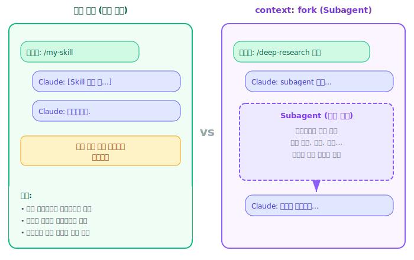

[← 이전: 실습 3: 동적 컨텍스트 주입](05-lab-dynamic-context.md) | [목차](index.md) | [다음: 실습 5: 시각적 출력 생성 →](07-lab-visual-output.md)

---

# 6. 실습 4: Subagent에서 실행되는 Skill

> **이 섹션에서 배울 것**: `context: fork`로 별도 subagent에서 Skill을 실행하는 방법, `agent` 필드의 의미

## Subagent란?

기본적으로 Skill은 메인 대화 안에서 실행됩니다. 하지만 `context: fork`를 설정하면 **별도의 subagent**에서 실행됩니다.

**subagent 장점** : context를 별도로 사용가능!!!!
 - token 이득
 - context 오염 X

<p align="center"></p>

## agent 필드

`agent` 필드로 subagent의 유형을 지정할 수 있습니다(option):

| 값 | 의미 |사용 가능 tool|사용 model|
|---|------|------------|----------|
| `Explore` | 코드베이스 검색 및 분석에 최적화된 빠른 읽기 전용 에이전트 |읽기 전용 도구 | Haiku 
| `Plan` | 계획을 제시하기 전에 컨텍스트를 수집하는 데 사용되는 연구 에이전트 | 읽기 전용 도구 |메인에서 상속
| `General-purpose` | 탐색과 작업 모두를 필요로 하는 복잡한 다단계 작업 | 모든 도구 |메인에서 상속
| (미지정) | 기본 에이전트 |

## 예제: deep-research Skill

코드베이스를 깊이 조사하여 보고서를 작성하는 Skill입니다.

```bash
mkdir -p .claude/skills/deep-research
```

`.claude/skills/deep-research/SKILL.md`:

```markdown
---
name: deep-research
description: >
  Deeply analyzes a codebase topic and writes a detailed research report.
  Use when investigating how a feature works, tracing dependencies,
  identifying issues, or understanding an unfamiliar part of the codebase.
argument-hint: <topic>
context: fork
agent: Explore
---

# 심층 코드 조사 Skill

## 조사 주제
$ARGUMENTS

## 작업 절차

### 1단계: 범위 설정
조사 주제와 관련된 파일, 디렉토리, 패턴을 식별합니다.

### 2단계: 코드 탐색
- 관련 파일을 모두 읽고 분석합니다.
- grep을 활용하여 관련 패턴을 찾습니다.
- 의존성 관계를 추적합니다.

### 3단계: 분석
- 현재 구현의 장단점을 분석합니다.
- 잠재적 문제점을 식별합니다.
- 관련 베스트 프랙티스와 비교합니다.

### 4단계: 보고서 작성
다음 형식으로 보고서를 작성하세요:

#### 조사 결과 요약
- 핵심 발견 사항 (3-5개 불릿 포인트)

#### 상세 분석
- 각 발견 사항에 대한 근거와 코드 참조

#### 권장 사항
- 우선순위가 높은 순서로 개선 방안 제시

#### 관련 파일 목록
- 조사에 관련된 모든 파일 경로
```

**사용 방법**:

```
/deep-research 보안 취약점 분석
```

이렇게 하면 별도의 subagent가 생성되어 코드베이스를 독립적으로 탐색하고 분석한 후, 결과를 메인 대화로 반환합니다.

---

[← 이전: 실습 3: 동적 컨텍스트 주입](05-lab-dynamic-context.md) | [목차](index.md) | [다음: 실습 5: 시각적 출력 생성 →](07-lab-visual-output.md)
